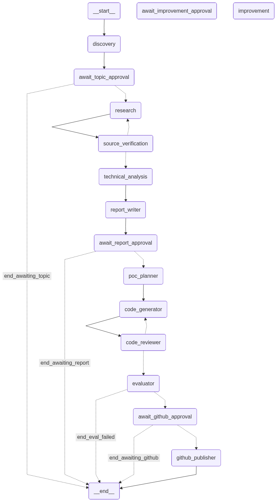

# Trend2POC — AI Research-to-GitHub Multi-Agent System

Turn any AI trend into a verified technical report, runnable proof-of-concept project, and structured GitHub knowledge folder — automatically.

---

## What It Does

Trend2POC is a multi-agent automation platform for AI engineers and data scientists who need to stay current with fast-moving AI/ML developments without spending hours on manual research.

**Input:** An AI topic (or let the system discover one)  
**Output:** A scored technical report + runnable POC project pushed to your GitHub knowledge base

### Pipeline

```
Discover Topics → Select Topic → [HITL: Approve Topic]
    → Research (tool-use) → Verify Sources → Technical Analysis → Write Report
    → [HITL: Approve Report]
    → Plan POC → Generate Code → Self-Critique → Fix → Review Code → Evaluate
    → [HITL: Apply Improvements?]
    → [HITL: Approve GitHub Push]
    → Publish to GitHub
```

Every step is visible in real time in the dashboard. Four human-in-the-loop gates prevent bad output from reaching GitHub.



---

## Key Features

- **11 specialized agents** — discovery, research, source verification, technical analysis, report writing, POC planning, code generation, code review, evaluation, improvement, and GitHub publishing
- **LLM-driven tool-use search** — research agent uses function calling to decide its own queries, drills into gaps, stops when satisfied (not fixed hardcoded queries)
- **Self-critique loop** — code generator critiques its own output and fixes errors before handing to external reviewer (up to 2 rounds)
- **3-tier source trust system** — discovery classifies sources as Primary (Tier 1), Technical Supporting (Tier 2), or Community Signal (Tier 3); topics require at least one Tier 1 source
- **Real-time SSE streaming** — each agent emits status immediately when it starts, not after it finishes
- **Human-in-the-loop gates** — approve topics, reports, improvements, and GitHub pushes from the UI
- **Evaluation scoring** — 7-dimension rubric (min 7.0/10 to proceed)
- **Improvement agent** — LLM rewrites weak report sections before publishing, shown as optional HITL gate
- **Retry mechanism** — resume failed runs from the last completed step (no re-running completed agents)
- **Secret scanning** — blocks any real credentials from reaching GitHub
- **Supabase persistence** — all runs, reports, sources, logs, and approvals stored with RLS
- **Cost tracking** — token usage and estimated USD cost per agent call and per run
- **Pydantic validation on all LLM outputs** — malformed responses caught at agent boundary, not silently propagated

---

## Agent Details

| Agent | Key Behaviour |
|---|---|
| Discovery | Freshness-aware queries (auto-updates year), Pydantic schema validation, dedup, normalize, error isolation |
| Research | LLM tool-use loop — calls `search_web()` adaptively, calls `finalize_research()` when done |
| Source Verification | Scores credibility, rejects weak sources, flags unsupported claims |
| Technical Analysis | Senior-engineer breakdown of architecture and data flow |
| Report Writer | Fills every field of the `ResearchReport` schema, returns structured JSON |
| POC Planner | Designs minimal runnable project with file list and dependencies |
| Code Generator | Generates files → self-critique (up to 2 rounds) → fix errors → submit |
| Code Reviewer | External syntax/deps/secrets check, routes back to generator on failure |
| Evaluator | 7-dimension weighted scoring, outputs improvement suggestions if score < 8.0 |
| Improvement | Rewrites weak report sections and files based on evaluator flags |
| GitHub Publisher | Secret scan → validate files → push to knowledge-base repo → store URL |

---

## Source Trust Tiers

The discovery agent classifies all sources into three tiers:

| Tier | Examples | Usage |
|---|---|---|
| **Tier 1 — Primary** | Official docs, arXiv papers, GitHub repos, Hugging Face, company blogs | Required — must have ≥1 Tier 1 source per topic |
| **Tier 2 — Supporting** | Medium, Substack, Dev.to, LinkedIn (from known engineers), personal blogs | Supports but cannot be sole evidence |
| **Tier 3 — Community Signal** | Reddit, Hacker News, LinkedIn comments, Twitter/X | Trend detection only — must verify with Tier 1 |

Topics with only Tier 3 evidence are automatically rejected.

---

## Stack

| Layer | Tech |
|---|---|
| Backend | Python 3.11+, FastAPI, LangGraph, Pydantic v2 |
| LLMs | Anthropic Claude, OpenAI GPT (configurable per run) |
| Search | Tavily (default), Exa, SerpAPI |
| Frontend | Next.js 14, React 18, TypeScript |
| Database | Supabase (PostgreSQL + RLS) |
| Real-time | Server-Sent Events (SSE) |
| Queue | Celery + Redis (production) |

---

## Project Structure

```
trend2poc/
├── backend/
│   └── app/
│       ├── agents/          # 11 specialized agent modules
│       ├── api/             # FastAPI routes (runs, reports, github, settings)
│       ├── core/
│       │   ├── schemas.py   # Pydantic models (ResearchReport, POCProject, etc.)
│       │   └── prompts/     # All LLM prompts as versioned .md files
│       ├── graph/
│       │   ├── state.py     # Trend2POCState, RunStatus enum
│       │   ├── workflow.py  # Sequential orchestrator with ckpt callbacks
│       │   └── routing.py   # Conditional edge routing functions
│       ├── integrations/    # LLM (tool-use loop), GitHub, Supabase, Search clients
│       └── services/        # Supabase sync, approval logic
├── frontend/
│   ├── app/
│   │   ├── dashboard/       # Run stats overview
│   │   ├── runs/[run_id]/   # Live run detail with HITL buttons + critique log
│   │   ├── reports/         # Browse and read published reports (formatted)
│   │   └── settings/        # GitHub + Supabase configuration UI
│   └── components/          # ReportView, HITLPanel, AgentTimeline, StatusTimeline, etc.
├── scripts/
│   ├── run_cli_pipeline.py  # Run full pipeline from CLI
│   └── test_single_topic.py # Test one topic end-to-end
├── evals/
│   └── rubric.json          # 7-dimension scoring rubric
├── test.ipynb               # LangGraph workflow visualisation (draw_mermaid_png)
└── .env.example
```

---

## Setup

### Prerequisites

- Python 3.11+
- Node.js 18+
- A GitHub repository for your knowledge base
- At least one LLM API key (Anthropic or OpenAI)
- At least one search API key (Tavily recommended)

### 1. Clone and configure

```bash
git clone <repo-url>
cd trend2poc
cp .env.example .env
```

Edit `.env` — minimum required keys:

```bash
ANTHROPIC_API_KEY=sk-ant-...        # or OPENAI_API_KEY
TAVILY_API_KEY=tvly-...
GITHUB_TOKEN=github_pat_...
GITHUB_REPO_OWNER=your-username
GITHUB_REPO_NAME=trend2poc-knowledge-base
API_SECRET_KEY=any-random-string
```

### 2. Backend

```bash
cd backend
python -m venv .venv
source .venv/bin/activate          # Windows: .venv\Scripts\activate
pip install -r ../requirements.txt
uvicorn app.main:app --reload --port 8000
```

### 3. Frontend

```bash
cd frontend
npm install
npm run dev
```

Open [http://localhost:3000](http://localhost:3000)

### 4. Supabase (optional but recommended)

Run the SQL from [docs/database.md](docs/database.md) in your Supabase SQL editor, then add credentials to `.env`. Without Supabase, runs still work — state is saved to `.checkpoints/` files locally.

---

## GitHub Token Setup

Trend2POC needs write access to push reports. Use a **fine-grained Personal Access Token**:

1. GitHub → Settings → Developer settings → Personal access tokens → Fine-grained tokens
2. Repository access: select your knowledge-base repo only
3. Permissions: **Contents → Read and Write**, Metadata → Read
4. Add token to `.env` as `GITHUB_TOKEN`

Or configure from the dashboard: **Settings → GitHub**.

---

## Running the Pipeline

### From the dashboard

1. Click **New Run** on the dashboard
2. Leave the topic blank (auto-discover) or enter a specific topic
3. Watch agents run live — status updates as each agent starts, not just when it finishes
4. Approve each HITL gate when prompted
5. View the formatted report with clickable source links
6. Approve GitHub push to publish

### From the CLI

```bash
# Auto-discover a topic
python scripts/run_cli_pipeline.py

# Specific topic
python scripts/run_cli_pipeline.py --topic "MCP for AI Agents"

# Test single topic (no GitHub push)
python scripts/test_single_topic.py --topic "LLM fine-tuning with LoRA"
```

### Retrying a failed run

If a run fails (e.g. GitHub 403, API timeout), click **Retry** in the run detail page. The system detects the last completed checkpoint and resumes from there — completed agents are not re-run.

---

## Evaluation Rubric

Reports must score ≥ 7.0/10 to proceed to GitHub publishing.

| Dimension | Weight |
|---|---|
| Research completeness | 20% |
| Technical accuracy | 25% |
| Source quality | 15% |
| Report clarity | 10% |
| POC usefulness | 10% |
| POC runnability | 10% |
| Security | 10% |

Target score: **8.0+/10**

If the score is ≥ 7.0 but evaluator suggests improvements, the Improvement Agent gate appears — user can apply rewrites or skip directly to GitHub approval.

---

## Generated GitHub Artifact Structure

Each approved topic produces this folder in your knowledge-base repo:

```
reports/
└── 2026-06-06_topic-slug/
    ├── README.md              # Setup and overview
    ├── report.md              # Full technical report
    ├── architecture.md        # Architecture and data flow
    ├── implementation.md      # How the POC code works
    ├── evaluation.md          # Score breakdown and flags
    ├── references.md          # Verified sources
    ├── .env.example           # Required env vars (no real secrets)
    ├── requirements.txt       # POC dependencies
    ├── app/                   # Runnable POC source code
    ├── tests/                 # Basic tests or syntax validation
    └── examples/              # Sample input/output
```

---

## HITL Gates

| Gate | Trigger | Actions |
|---|---|---|
| Topic Approval | After discovery + selection | Approve, reject, or change topic |
| Report Review | After report generation | Approve or request revision |
| Improvement Review | If evaluator suggests improvements (optional) | Apply LLM rewrites or skip |
| GitHub Push | After evaluation passes | Publish, hold, or reject |

All approvals are stored in Supabase with timestamp, user ID, and notes.

---

## Security Rules

- No real secrets ever reach GitHub — secret scanner runs before every push
- `SUPABASE_SERVICE_ROLE_KEY` used only in backend, never exposed to frontend
- `AUTO_PUSH_TO_GITHUB` defaults to `false` — human approval always required
- Generated POC code is syntax-checked but not executed on the host
- Discovery agent rejects sources that are purely promotional or marketing-only

---

## Environment Variables Reference

| Variable | Required | Description |
|---|---|---|
| `ANTHROPIC_API_KEY` | One of these | Claude LLM |
| `OPENAI_API_KEY` | One of these | GPT LLM |
| `TAVILY_API_KEY` | One of these | Web search |
| `GITHUB_TOKEN` | Yes | Fine-grained PAT with repo write access |
| `GITHUB_REPO_OWNER` | Yes | Your GitHub username or org |
| `GITHUB_REPO_NAME` | Yes | Knowledge-base repo name |
| `API_SECRET_KEY` | Yes | Backend API authentication |
| `SUPABASE_URL` | Optional | Supabase project URL |
| `SUPABASE_ANON_KEY` | Optional | Supabase public key |
| `SUPABASE_SERVICE_ROLE_KEY` | Optional | Supabase admin key (backend only) |
| `MIN_EVAL_SCORE` | No | Minimum score to allow GitHub push (default: 7.0) |
| `MAX_RUN_COST_USD` | No | Cost limit per run (default: 3.00) |

---

## Build Phases

| Phase | Status | Description |
|---|---|---|
| 1 — CLI POC | Done | Single-topic research + report generation |
| 2 — Code Generation | Done | POC planner, generator, self-critique loop, reviewer |
| 3 — GitHub Integration | Done | PAT auth, secret scan, push, retry on failure |
| 4 — Multi-Agent Workflow | Done | Sequential orchestrator, HITL gates, live SSE checkpoints |
| 5 — Supabase + FastAPI | Done | Persistence, API routes, RLS, approval records |
| 6 — Frontend Dashboard | Done | Real-time SSE, formatted report viewer, self-critique log, approval UI |
| 7 — Agent Quality | Done | Tool-use search, self-critique, 3-tier source trust, Pydantic validation |
| 8 — Production Hardening | Planned | Celery, GitHub App auth, Docker sandbox, regression evals |

---

## License

MIT
